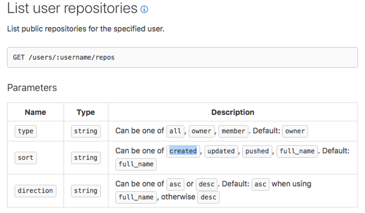

# GitHub as a Data Source
Now that we understand the distinction between Git and GitHub, we can understand the rich data set that each source can provide. A researcher can obtain data either from the Git repository or from the GitHub platform, with each platform having a different method for accessing the data and offering its own unique set of data as well as advantages.
## Research Data from Git
Git can provide data about changes to the source code. Specifically, it can provide data about what changes were made in a repository, when they were made and by whom. It does not provide any information related to the social coding interactions that occur on GitHub. Since Git is a tool that is not unique to GitHub, the information shared in this section applies to Git repositories hosted on platforms other than GitHub as well. Researchers can obtain research data by extracting useful information directly from the source code—such as metrics and dependency graphs—or can choose to extract meta-information that describes who changed what in the repository. The methods described here are not specific to repositories hosted on GitHub, but can be applied to any Git repository that a researcher can clone to his or her computer.
The general steps a researcher must follow to extract data from Git are:
1.	Clone the Git repository to the local machine using Git clone;
2.	Revert to a specific revision of the code base to extract data for a specific point in time using Git checkout <revision>;
3.	Extract data directly from source code, or from metadata using commands such as git log, git diff, or git blame. 
### Cloning Repos
There are two types of repository URLs on GitHub, depending on whether SSH or HTTPS URLs are used:
-	SSH URL: git@github.com:<ownername>/<reponame>.git
-	HTTPS URL: https://github.com/<ownername>/<reponame>.git
The repo URL in both formats consists of two main parts: the GitHub hostname and the project full name. The project full name is the path consisting of both the owner name and repo name. The project full name is a unique value on GitHub and can be used to identify any repository, even forked ones. For example:
1.	git@github.com:remoteinterview/zero.git
2.	git@github.com:0xflotus/zero.git
3.	git@github.com:anblandy/zero.git
4.	git@github.com:django/django.git
All four of these repositories are hosted on GitHub. The first three are three forks for the same project, “zero”, which belongs to three different owners: remoteinterview, 0xflotus, and anblandy. The fourth repo is an entirely different project, “django”, and is owned by the user django. When referring to a repo on GitHub, it is better to always use the owner/repo notation to identify a repository.
### 3.1.2	Identifying Revisions
Git keeps snapshots of files in the file system and records how these change over time. Central to these changes is the concept of revision, which is a 40-character unique ID (SHA1 hash) that corresponds to a successful commit operation and identifies a specific snapshot in time. Researchers who know the revision IDs can virtually travel in time to view different versions of a file, directory, or even complete a repository. 
To identify revisions—and extract useful meta-information—researchers can use the git log command:
```bash
commit f1f4aeb22e7bc9b504f69f7cb111ac9bdedb5f1e (HEAD -> master, origin/master, origin/HEAD)
Author: Dohyeon Kim <nero.union12@gmail.com>
Date:   Tue May 29 21:41:32 2018 +0900

    Fixed #28044 -- Unified the logic for createsuperuser's interactive and --noinput modes.

commit 0914a2003b1ad50f1d641709da86c14826bf063b
Author: Wang Dongxiao <me@wangdongxiao.com>
Date:   Mon May 28 21:14:46 2018 +0800

    Added 'caches' to django.core.cache.__all__.
```
The output shows the history for two revisions. The first line includes the revision ID following the word commit, followed by the author name, the date, and, finally, a commit message written by the author to describe what was done in this revision. It is important to note that all data in Git is textual and must be extracted by writing scripts to produce the output and parse the required information from it.

The git log command is quite flexible. The output can be customized using the --pretty or --format flags<sup>[1](#myfootnote1)</sup>. But the most useful options for the command are the ones that allow a researcher to filter commits based on date ranges, author names, or even commit messages. For example, the command git log --after="2017-01-01" --before="2017-02-01" would produce a list of commits in reverse chronological order for all commits between January 1, 2017, and February 1, 2017 (inclusive).
Typically, a researcher might sample some commits on specific dates. The researcher must clearly define the sampling protocol which must include:
-   The date range as well as the sampling duration;
-	Which commit is selected from the date range (e.g., first or last);
-	The order in which the commits are organized—Git defaults to commit date;
-	Whether commit date and author date are used to select the sample. Author date can be different depending on the workflow. The author date is when the patch was written, the commit date is when it was committed to the current code base.

One tip we can offer to simplify parsing and sampling of revision IDs is to format the log message to be shown on a single line and show only information relevant to the sampling process. Adding the option --pretty="%h %cD %s" to the command would achieve that and makes it easier to parse the output.
Once the revision to be included in the analysis is identified, the Git checkout <revision id> is used to switch to that revision, and then the data extraction process can begin. Other features in Git that might be useful in identifying revisions, and that might carry some useful information on the development process as well, are tags and branches. Such features might be too advanced for this tutorial, but they are important tools for identifying important revisions in a repository and we highly encourage researchers to familiarize themselves with them<sup>[2](#myfootnote2)</sup>.  

### Extracting the Data
We found that there are four useful sources from which researchers can extract research data in Git. The first is the source code, from which software tools are used to extract software metrics, such as lines of code, modularity, cyclomatic complexity, and so forth. The field of software engineering is dedicated to the study and validation of such metrics, and can also be relevant to understanding developer behavior (cf. Brooks, 1975).
The second source is associated with the git log command, which we have discussed as a means of identifying relevant revisions in Section ‎3.1.2. The output of the command can be modified to reveal rich metadata about the development process, which can then be parsed and converted into useful research data.
The third useful source is generated by the git diff command. This command identifies all the differences (i.e. changes made to files) between two revisions. It also includes an option for showing certain statistics concerning what changed between two revisions. For example, to see what changed in a repository over a one-month period, we identified revision 6128c1736d on Jan 1, 2017, as the first revision for the django/django repository using the git log command. We then identified c4e18bb1ce on Feb 1, 2017, as the last revision for the same repository. We then issued the command git diff 6128c1736d c4e18bb1ce to reveal every file and line change that occurred between these two revisions. Adding the --stat option to the command generates a statistical summary of the changes, while the --dirstat option shows the distribution of work over source code directories.
The fourth command for extracting useful information is git blame <file path>. The command is performed on a specific file, and lists all authors and the line-by-line changes they made to the file. This is a very useful command for identifying relationships among developers based on the files they have worked on, or even the lines, and is an invaluable tool for constructing networks for social network analysis. It can also be used to count the collaborators on a file or show the sequence of their work and whether there was overlap in the changes they made to the file. 
It is important to reiterate that all these sources are text based, and researchers must write scripts to produce and parse the outputs, then prepare the results in a format that can be used for data analysis. The code sample at https://github.com/qmisr/github_data_tutorial shows some examples of how data can be extracted from a Git repository. Other challenges include some commonly held misconceptions about the type of data Git offers and how reliable it might be. We refer readers to Bird et al.’s work (2009), which summarizes the common perils of mining Git and offers suggestions on how to avoid them.

##	Research Data from GitHub API
As explained in Section ‎2, GitHub built a social layer on top of the Git platform. As such, it can provide information that is nonexistent on a Git repo—including information related to social-coding interactions occurring on the GitHub platform, such as pull requests, forks, discussions, issues, and much more. In addition, GitHub might make it more convenient to extract certain types of information from Git. The main difference between the two sources is the way that the data are accessed. Git makes all information available locally without the need for an internet connection to extract it. GitHub, on the other hand, requires extracting data from the GitHub website, either by means of the API provided by GitHub or by “scraping" the website. Therefore, an internet connection is needed and the data collection may be slower and/or constrained by access limits imposed by the API.
The following is required to access the GitHub API:
1.	GitHub account
2.	GitHub access token obtained from https://github.com/settings/tokens
3.	Ability to use a programming language with third-party libraries for REST or GraphQL API access 
Our examples use Python to access the REST API. Other languages, such as JavaScript, Ruby, Java, or PHP can also be used. We chose Python for its simplicity, as well as the availability of third-party libraries for REST API access and data handling and manipulation. For convenience, we use the Jupyter notebook to show our examples and host them on GitHub. We also use requests for API access and Pandas for data handling .
The GitHub token is needed to perform authenticated API requests. While it is possible to perform unauthenticated requests for some of the public data, we highly recommend that all requests be authenticated. API users get a much larger access quota when performing authenticated requests, and much of the useful and detailed information provided by the API requires authentication. 
Once the requirements are met, it is a matter of identifying the correct URL to fetch the required data. The API URLs are referred to as end points. The endpoints, as well as all information necessary to use the GitHub API, are available at https://developer.github.com/v3/.
The following steps must be performed whenever data is fetched from the GitHub API:
1.	Constructing the request
2.	Fetching and parsing the response
### constructing-the-request
To construct the request, the researcher must refer to the API reference manual found at https://developer.github.com/v3/. In the column on the right, the reference provides a list of data resources that can be queried. Repositories is a likely starting point; selecting it shows the user the available actions that can be performed using the REST API as seen in the figure:


Of greatest interest to researchers are primarily actions that fetch data—mainly, list and get. Other actions perform operations on GitHub and are used primarily by GitHub clients and can be ignored. The list operation generally fetches a list of data items formatted as JSON objects. The get operation fetches a single data object as a JSON object as well. We have found that list actions are highly useful and offer very rich data; while get operations are highly useful when details are missing.

To list the repositories owned by a user, the List user repositories link should be selected, which reveals how the API request is constructed as in the following figure: 



To construct the request, the user needs to know the HTTP verb used, the URL path, and the required parameters. Looking at the top part of the previous figure, the URL path and an HTTP verb for fetching data from this resource are highlighted (i.e., GET /user/:username/repos). The GET part indicates that this resource is accessed using a GET HTTP verb. Most data collection using the API uses the GET verb. This means that when the requests library is used to access the API, the user will always make a get call, rather than a put or a post.

The path has a username part preceded by a colon (:), indicating that the username is a placeholder. To get the correct path, the placeholder must be replaced with the GitHub username of the user whose repositories are desired. For example, to list the repositories for the GitHub user Andrew, the path will be /user/andrew/repos. The final URL of the endpoint requires that the user prepends the GitHub API hostname to the path, and, therefore, the endpoint will be api.github.com/users/andrew/repos. An attractive feature of the GitHub REST API is that if the request does not require authentication, one can open that URL in any web browser and view the JSON response from the API. This reveals a list and rich data about of all the repositories that user Andrew (in this case) is a member of.
The bottom part of previous figure shows the optional parameters of the request. These are used to modify response behaviors such as sorting and filtering. Typically, the required parameters are made as a variable part in the URL, and the optional parameters are included in the request payload.

### Parsing the Response
Since all GitHub API responses are JSON-based, it is easy to take advantage of JSON parsing libraries in any programming language. Luckily, the requests library in Python already has that feature built in, which can be easily be taken advantage of. Every GitHub API response contains the data requested from the API in the form of a JSON object or list of objects. For example, the following is the response to the list of repositories for the user Andrew:

```json
[
  {
    "id": 14993753,
    "node_id": "MDEwOlJlcG9zaXRvcnkxNDk5Mzc1Mw==",
    "name": "3D-contributions",
    "full_name": "andrew/3D-contributions",
    "private": false,
    "owner": {
      "login": "andrew",
      "id": 1060,
      "node_id": "MDQ6VXNlcjEwNjA=",
      "avatar_url": "https://avatars2.githubusercontent.com/u/1060?v=4",
      "gravatar_id": "",
       ….
      "type": "User",
      "site_admin": false
    },
    "html_url": "https://github.com/andrew/3D-contributions",
    "description": "[UNMAINTAINED] 3D print your github contributions graph",
    "fork": false,
    …
    }
]
```
The response is simply a list of JSON objects that can be easily parsed using any JSON parsing library. Because the response is in JSON, the structure can vary from one response to the other. Therefore, it is important to always refer to the GitHub API to see what the structure of the response will look like. In addition, the researcher can print out the response to observe how it is structured.
The response might also contain metadata that might provide additional information to the researcher about the response, as is the case with search API responses such as the following:
```json
{
  "total_count": 410,
  "incomplete_results": false,
  "items": [
    {
      "login": "kevinzhow",
      "id": 1156192,
      "node_id": "MDQ6VXNlcjExNTYxOTI=",
      "avatar_url": "https://avatars1.githubusercontent.com/u/1156192?v=4",
      "gravatar_id": "",
      "url": "https://api.github.com/users/kevinzhow",
      "html_url": "https://github.com/kevinzhow",
      "followers_url": "https://api.github.com/users/kevinzhow/followers",
      "following_url": "https://api.github.com/users/kevinzhow/following{/other_user}",
      "gists_url": "https://api.github.com/users/kevinzhow/gists{/gist_id}",
      "starred_url": "https://api.github.com/users/kevinzhow/starred{/owner}{/repo}",
      "subscriptions_url": "https://api.github.com/users/kevinzhow/subscriptions",
      "organizations_url": "https://api.github.com/users/kevinzhow/orgs",
      "repos_url": "https://api.github.com/users/kevinzhow/repos",
      "events_url": "https://api.github.com/users/kevinzhow/events{/privacy}",
      "received_events_url": "https://api.github.com/users/kevinzhow/received_events",
      "type": "User",
      "site_admin": false,
      "score": 1.0
    },
    …
}

```
The response is a JSON object containing the following information:
-	Total_count: the total number of users that match the search query to the API.
-	Incomplete_result: an indication whether the result contains all the data, or partial data because the response is too big.
-	Items: a list containing the requested data from the API.
Because the results can have varying structures, we found the best method to parse the GitHub API responses in Python is to use the requests library to fetch and parse the response into JSON, then use json_normalize to flatten the JSON data structure into a simple Pandas DataFrame. The following is an example of how to accomplish this task:

```python
# load the required libraries
import requests
import pandas as pd
from pandas.io.json import json_normalize

# construct get request and fetch response
res = requests.get("https://api.github.com/users/andrew/repos")

# parse response as json, then flatten it into a dataframe
df = json_normalize(res.json())

# store the dataframe as a csv file
df.to_csv("andrew_repos.csv")
```
The previous example will work for any GitHub API request, since the request and response methods are standardized. Once the response is parsed into a Pandas DataFrame, the researcher can clean and manipulate the data in Python using the Pandas Framework. Alternatively, the researcher can choose to store the data frame as a CSV file and load the data in his/her data analysis platform of choice (e.g., excel or R).

### Paginated Responses
The GitHub API responses are limited to 100 objects per request. Results that contain more than 100 objects are split over multiple pages and must be fetched over multiple requests. This method of distributing data over multiple pages is known as pagination. So, some requests require a series of request/response cycles before the researcher gets the required data. In such cases, the researcher should know how to fetch the data from the API and combine the data into a single data structure on his or her machine. Our sample data collection scripts hosted on https://github.com/qmisr/github_data_tutorial present an example of this task.   
In addition to the JSON payload, the GitHub API responses include additional metadata in the HTTP header of the response. The header information also includes a Link header that contains hyperlinks used to navigate response pages. The Link header can look something like this:

```json
Link: <https://api.github.com/search/commits?q=%22release+1.0%22&page=2>; rel="next", <https://api.github.com/search/commits?q=%22release+1.0%22&page=34>; rel="last"
```
The Link header contains two hyperlinks: the first with a rel value set to next, meaning that the data should be fetched from the next page. Notice how the link contains the parameter page=2. To navigate pages, the researcher can increment the page parameter by one. The best approach, however, is to fetch the hyperlink from the Link header with rel=next to fetch the next data page.
Notice also the link for the rel=last page, the page value in the hyperlink is set to 34, meaning that there is a total of 34 pages of data to fetch. The researcher must loop over all pages from 1 to 34 to fetch all the data in this response. Rate limiting could be a potential challenge that a researcher might face when fetching paginated responses. We recommend that authenticated requests be used so that a larger API access quota is given to the researcher. But one should keep in mind that the quota is time-based and is renewed every hour or minute depending on the API.
A total of 60 requests per hour are allowed for unauthenticated requests, but it is possible to make 5000 authenticated requests per hour. Because the search API is more demanding, the limit in this case is set to 30 requests per minute for authenticated requests, and 10 requests per minute for unauthenticated requests. Therefore, should the researcher exceed the allotted quota, her or she must wait before issuing another request . 
Other rel values that can be included in the Link header include first and prev. As these names suggest, first indicates the first page of the response, and prev indicates the previous page. Depending on which page the researcher requests, some rel values will be missing, information which could identify what point the researcher reached in the pages. For example, one useful fact about Link headers is that once the last page is requested, the rel=next hyperlink will no longer be available in the Link header. The researcher can use this fact to ascertain that the last page of the paginated data was reached.
###	The Search API
A more likely use scenario for fetching repositories is to fetch them based on some filtration criteria, and for that, the GitHub Search API is used. Some of the criteria used to search for repositories include number of forks, programming language, keywords in descriptions or README files, archived and forked repositories, and much more. The response received from the search API is a list of repositories and is  very similar in structure to the list of repositories fetched for a specific user and can be parsed in much the same way. The search API is much more useful when the researcher wants to select a sample of repositories on which to base a study. The researcher could use the list of repositories from the search results, write a script to randomly select a subset from the available list, or even combine samples from different search criteria. Furthermore, the search API is not limited to repositories alone, but can be used to search for user, commits, code, topics, issues, and pull requests. As such, it is an invaluable sampling tool for the researcher. The Search API, however, is limited in that it provides a maximum of only 1000 results, even with pagination. However, researchers can get around this limitation by combining the search results from multiple specific searches into one big data set.
Constructing a search request is very similar to the way a list repository request is constructed, as discussed in [Constructing the Request section](#constructing-the-request). The endpoint for the search request would be https://api.github.com/search/<resource to search>/ with a required search query parameter named q. The resources that can be searched include repositories, topics, code, issues, commits, and users.
At the very least, the q parameter should contain a single keyword to get a response. The query can also contain multiple keywords and qualifiers. The syntax requires that keywords precede all qualifiers; thus, all queries will have the syntax q=keyword1+keyword2+…keywordn+qualifier1+qualifier2+…qualifier_n. It is necessary to prepend the search API endpoint https://api.github.com/search/ before each of the following examples:


# Footnotes
<a name="myfootnote1">[1]</a>: The complete git log reference can be found at https://git-scm.com/docs/git-log and the pretty format syntax to customize the log output is described at https://git-scm.com/docs/pretty-formats.

<a name="myfootnote2">[2]</a>: We would highly encourage the reader to get more familiar with how developers use Git to better make use of the data it makes available. Since this is an introductory tutorial, we will refer the reader to https://git-scm.com/book/en/v2/Git-Basics-Tagging for more information on tagging, and https://git-scm.com/book/en/v2/Git-Branching-Basic-Branching-and-Merging for more information on branching.

# References

brooks

Birds 2009
