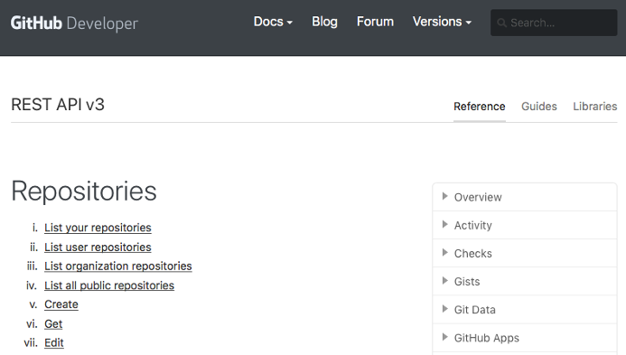

# GitHub as a Data Source
Now that we understand the distinction between Git and GitHub, we can understand the rich data set that each source can provide. A researcher can obtain data either from the Git repository or from the GitHub platform, with each platform having a different method for accessing the data and offering its own unique set of data as well as advantages.
## Research Data from Git
Git can provide data about changes to the source code. Specifically, it can provide data about what changes were made in a repository, when they were made and by whom. It does not provide any information related to the social coding interactions that occur on GitHub. Since Git is a tool that is not unique to GitHub, the information shared in this section applies to Git repositories hosted on platforms other than GitHub as well. Researchers can obtain research data by extracting useful information directly from the source code—such as metrics and dependency graphs—or can choose to extract meta-information that describes who changed what in the repository. The methods described here are not specific to repositories hosted on GitHub, but can be applied to any Git repository that a researcher can clone to his or her computer.
The general steps a researcher must follow to extract data from Git are:
1.	Clone the Git repository to the local machine using Git clone;
2.	Revert to a specific revision of the code base to extract data for a specific point in time using Git checkout <revision>;
3.	Extract data directly from source code, or from metadata using commands such as git log, git diff, or git blame. 
### Cloning Repos
There are two types of repository URLs on GitHub, depending on whether SSH or HTTPS URLs are used:
-	SSH URL: git@github.com:<ownername>/<reponame>.git
-	HTTPS URL: https://github.com/<ownername>/<reponame>.git
The repo URL in both formats consists of two main parts: the GitHub hostname and the project full name. The project full name is the path consisting of both the owner name and repo name. The project full name is a unique value on GitHub and can be used to identify any repository, even forked ones. For example:
1.	git@github.com:remoteinterview/zero.git
2.	git@github.com:0xflotus/zero.git
3.	git@github.com:anblandy/zero.git
4.	git@github.com:django/django.git
All four of these repositories are hosted on GitHub. The first three are three forks for the same project, “zero”, which belongs to three different owners: remoteinterview, 0xflotus, and anblandy. The fourth repo is an entirely different project, “django”, and is owned by the user django. When referring to a repo on GitHub, it is better to always use the owner/repo notation to identify a repository.
### 3.1.2	Identifying Revisions
Git keeps snapshots of files in the file system and records how these change over time. Central to these changes is the concept of revision, which is a 40-character unique ID (SHA1 hash) that corresponds to a successful commit operation and identifies a specific snapshot in time. Researchers who know the revision IDs can virtually travel in time to view different versions of a file, directory, or even complete a repository. 
To identify revisions—and extract useful meta-information—researchers can use the git log command:
```bash
commit f1f4aeb22e7bc9b504f69f7cb111ac9bdedb5f1e (HEAD -> master, origin/master, origin/HEAD)
Author: Dohyeon Kim <nero.union12@gmail.com>
Date:   Tue May 29 21:41:32 2018 +0900

    Fixed #28044 -- Unified the logic for createsuperuser's interactive and --noinput modes.

commit 0914a2003b1ad50f1d641709da86c14826bf063b
Author: Wang Dongxiao <me@wangdongxiao.com>
Date:   Mon May 28 21:14:46 2018 +0800

    Added 'caches' to django.core.cache.__all__.
```
The output shows the history for two revisions. The first line includes the revision ID following the word commit, followed by the author name, the date, and, finally, a commit message written by the author to describe what was done in this revision. It is important to note that all data in Git is textual and must be extracted by writing scripts to produce the output and parse the required information from it.

The git log command is quite flexible. The output can be customized using the --pretty or --format flags<sup>[1](#myfootnote1)</sup>. But the most useful options for the command are the ones that allow a researcher to filter commits based on date ranges, author names, or even commit messages. For example, the command git log --after="2017-01-01" --before="2017-02-01" would produce a list of commits in reverse chronological order for all commits between January 1, 2017, and February 1, 2017 (inclusive).
Typically, a researcher might sample some commits on specific dates. The researcher must clearly define the sampling protocol which must include:
-   The date range as well as the sampling duration;
-	Which commit is selected from the date range (e.g., first or last);
-	The order in which the commits are organized—Git defaults to commit date;
-	Whether commit date and author date are used to select the sample. Author date can be different depending on the workflow. The author date is when the patch was written, the commit date is when it was committed to the current code base.

One tip we can offer to simplify parsing and sampling of revision IDs is to format the log message to be shown on a single line and show only information relevant to the sampling process. Adding the option --pretty="%h %cD %s" to the command would achieve that and makes it easier to parse the output.
Once the revision to be included in the analysis is identified, the Git checkout <revision id> is used to switch to that revision, and then the data extraction process can begin. Other features in Git that might be useful in identifying revisions, and that might carry some useful information on the development process as well, are tags and branches. Such features might be too advanced for this tutorial, but they are important tools for identifying important revisions in a repository and we highly encourage researchers to familiarize themselves with them<sup>[2](#myfootnote2)</sup>.  

### Extracting the Data
We found that there are four useful sources from which researchers can extract research data in Git. The first is the source code, from which software tools are used to extract software metrics, such as lines of code, modularity, cyclomatic complexity, and so forth. The field of software engineering is dedicated to the study and validation of such metrics, and can also be relevant to understanding developer behavior (cf. Brooks, 1975).
The second source is associated with the git log command, which we have discussed as a means of identifying relevant revisions in Section ‎3.1.2. The output of the command can be modified to reveal rich metadata about the development process, which can then be parsed and converted into useful research data.
The third useful source is generated by the git diff command. This command identifies all the differences (i.e. changes made to files) between two revisions. It also includes an option for showing certain statistics concerning what changed between two revisions. For example, to see what changed in a repository over a one-month period, we identified revision 6128c1736d on Jan 1, 2017, as the first revision for the django/django repository using the git log command. We then identified c4e18bb1ce on Feb 1, 2017, as the last revision for the same repository. We then issued the command git diff 6128c1736d c4e18bb1ce to reveal every file and line change that occurred between these two revisions. Adding the --stat option to the command generates a statistical summary of the changes, while the --dirstat option shows the distribution of work over source code directories.
The fourth command for extracting useful information is git blame <file path>. The command is performed on a specific file, and lists all authors and the line-by-line changes they made to the file. This is a very useful command for identifying relationships among developers based on the files they have worked on, or even the lines, and is an invaluable tool for constructing networks for social network analysis. It can also be used to count the collaborators on a file or show the sequence of their work and whether there was overlap in the changes they made to the file. 
It is important to reiterate that all these sources are text based, and researchers must write scripts to produce and parse the outputs, then prepare the results in a format that can be used for data analysis. The code sample at https://github.com/qmisr/github_data_tutorial shows some examples of how data can be extracted from a Git repository. Other challenges include some commonly held misconceptions about the type of data Git offers and how reliable it might be. We refer readers to Bird et al.’s work (2009), which summarizes the common perils of mining Git and offers suggestions on how to avoid them.

##	Research Data from GitHub API
As explained in Section ‎2, GitHub built a social layer on top of the Git platform. As such, it can provide information that is nonexistent on a Git repo—including information related to social-coding interactions occurring on the GitHub platform, such as pull requests, forks, discussions, issues, and much more. In addition, GitHub might make it more convenient to extract certain types of information from Git. The main difference between the two sources is the way that the data are accessed. Git makes all information available locally without the need for an internet connection to extract it. GitHub, on the other hand, requires extracting data from the GitHub website, either by means of the API provided by GitHub or by “scraping" the website. Therefore, an internet connection is needed and the data collection may be slower and/or constrained by access limits imposed by the API.
The following is required to access the GitHub API:
1.	GitHub account
2.	GitHub access token obtained from https://github.com/settings/tokens
3.	Ability to use a programming language with third-party libraries for REST or GraphQL API access 
Our examples use Python to access the REST API. Other languages, such as JavaScript, Ruby, Java, or PHP can also be used. We chose Python for its simplicity, as well as the availability of third-party libraries for REST API access and data handling and manipulation. For convenience, we use the Jupyter notebook to show our examples and host them on GitHub. We also use requests for API access and Pandas for data handling .
The GitHub token is needed to perform authenticated API requests. While it is possible to perform unauthenticated requests for some of the public data, we highly recommend that all requests be authenticated. API users get a much larger access quota when performing authenticated requests, and much of the useful and detailed information provided by the API requires authentication. 
Once the requirements are met, it is a matter of identifying the correct URL to fetch the required data. The API URLs are referred to as end points. The endpoints, as well as all information necessary to use the GitHub API, are available at https://developer.github.com/v3/.
The following steps must be performed whenever data is fetched from the GitHub API:
1.	Constructing the request
2.	Fetching and parsing the response
###	Constructing the Request
To construct the request, the researcher must refer to the API reference manual found at https://developer.github.com/v3/. In the column on the right, the reference provides a list of data resources that can be queried. Repositories is a likely starting point; selecting it shows the user the available actions that can be performed using the REST API as seen in the figure:




# Footnotes
<a name="myfootnote1">[1]</a>: The complete git log reference can be found at https://git-scm.com/docs/git-log and the pretty format syntax to customize the log output is described at https://git-scm.com/docs/pretty-formats.

<a name="myfootnote2">[2]</a>: We would highly encourage the reader to get more familiar with how developers use Git to better make use of the data it makes available. Since this is an introductory tutorial, we will refer the reader to https://git-scm.com/book/en/v2/Git-Basics-Tagging for more information on tagging, and https://git-scm.com/book/en/v2/Git-Branching-Basic-Branching-and-Merging for more information on branching.

# References

brooks

Birds 2009
